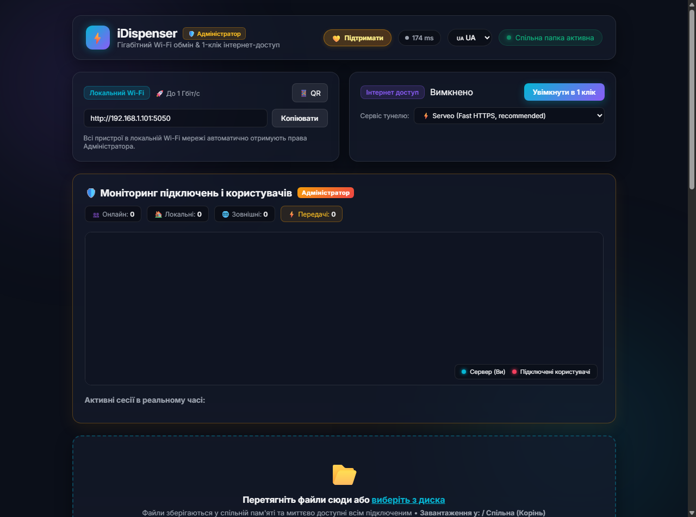
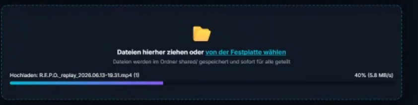
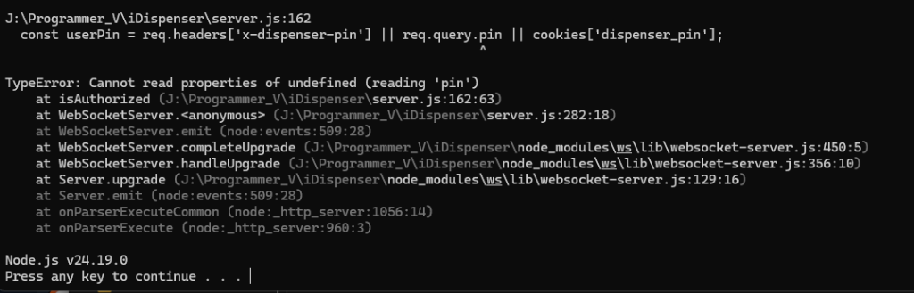

<div align="center">


# ⚡ iDispenser

**High-Speed Local & Remote P2P File Sharing Server**  
*Ultra-fast, cross-platform file dispenser with real-time speed monitoring, chunked uploads, and interactive geolocation map.*

[](https://nodejs.org)
[](https://expressjs.com)
[](https://developer.mozilla.org/en-US/docs/Web/API/WebSockets_API)
[](LICENSE)
[](https://www.paypal.com/donate/?business=mercooler666@gmail.com&no_recurring=0&currency_code=USD)

[English](#-english) • [Українська](#-українська) • [Русский](#-русский)

</div>

---

## 📸 Screenshots

<div align="center">
  <h3>🖥️ Main Web Dashboard</h3>
  
</div>

<br />

<div align="center">
  <table width="100%">
    <tr>
      <td width="50%" align="center">
        <h4>🛡️ Admin Geo-IP Map & Active Monitoring</h4>
        
      </td>
      <td width="50%" align="center">
        <h4>📱 Mobile & Remote Responsive View</h4>
        
      </td>
    </tr>
  </table>
</div>

---

## 🌟 English

### Key Features
* 🚀 **Gigabit Wi-Fi Speed:** Transfer large files at native LAN speeds up to 1 Gbps with no third-party cloud bottleneck.
* 🌐 **1-Click Internet Sharing:** Built-in encrypted tunnel integration (Cloudflare / Serveo) to instantly share files outside the local network.
* 📦 **Bulletproof Chunked Upload Engine:** Files are automatically sliced into 5MB chunks (`file.slice()`) on client side with automatic 3x retries. Completely bypasses Cloudflare’s 100MB body limit and handles multi-gigabyte videos and archives reliably.
* 📶 **Live Latency & Speed Monitoring:** Real-time ping latency badge (<50ms green, 50-150ms yellow, >150ms red), live transfer speed (MB/s), and dynamic ETA countdown.
* 🗺️ **Admin Monitoring & Geo-IP Map:** Interactive dark-mode OpenStreetMap showing where external users are connecting from, their device, OS, browser, IP, and real-time upload/download activity.
* 📁 **1-Click Shared Folders:** Users can create subfolders in one click, navigate via breadcrumbs, and upload directly into specific folders.
* 🛡️ **Role-Based Security:**
  * Local network devices automatically gain **Administrator** rights.
  * External users connect as **Users** (download/upload allowed, deletion strictly restricted to Admins).
  * 4-digit PIN protection for external guests.
  * Dynamic admin rights assignment from the monitoring panel.
* 🌍 **5-Language UI:** English, Ukrainian, Russian, German, and Italian with auto-detection based on country code and browser preference.
* 💻 **1-Click Windows Launcher:** Fast launch script (`run.bat`) with automated dependency check and browser launch.
* 💛 **PayPal Donation:** Integrated support button and modal for easy project patronage.

---

## 🌟 Українська

### Основні можливості
* 🚀 **Гігабітна швидкість:** Передача великих файлів у локальній мережі Wi-Fi без обмежень сторонніх хмарних сховищ.
* 🌐 **Інтернет-доступ в 1 клік:** Вбудована інтеграція з тунелями (Cloudflare / Serveo) для безпечного доступу з будь-якої точки світу.
* 📦 **Блочна загрузка (Chunked Upload):** Файли автоматично нарізаються на порції по 5 МБ із 3 автоповторами. Повністю знімає ліміти Cloudflare на 100 МБ.
* 📶 **Відображення пінгу та швидкості:** Живий індикатор пінгу в шапці сайту, вимірювання швидкості передачі (МБ/с) та розрахунок залишкового часу (ETA).
* 🗺️ **Інтерактивна карта підключень:** Панель адміністратора з картою OpenStreetMap у темній темі, що показує звідки підключився користувач, його пристрій, IP та поточну передачу файлів.
* 📁 **Спільні папки в 1 клік:** Створення нових папок в один клік, навігація за «хлібними крихтами» (Breadcrumbs).
* 🛡️ **Захист та ролі:** Повний захист від видалення звичайними користувачами, автоматичні права адміністратора в локальній мережі та PIN-код для гостей.
* 🌍 **5 мов інтерфейсу:** Українська, Англійська, Російська, Німецька, Італійська.

---

## 🌟 Русский

### Ключевые возможности
* 🚀 **Гигабитная скорость передачи:** Прямая отдача и прием файлов в локальной Wi-Fi сети со скоростью до 1 Гбит/с.
* 🌐 **Интернет-туннель в 1 клик:** Мгновенная генерация публичной ссылки и QR-кода через Cloudflare / Serveo.
* 📦 **Блочная загрузка без зависаний:** Файлы любого размера передаются чанками по 5 МБ, решая проблему обрыва соединения на больших видеозаписях.
* 📶 **Пинг и скорость в реальном времени:** Точное отображение сетевой задержки, скорости загрузки/скачивания (MB/s) и оставшегося времени.
* 🗺️ **Мониторинг пользователей на карте:** Карта подключений с отображением города, страны, устройства и текущего трансфера каждого клиента.
* 📁 **Общие папки и навигация:** Создание общих папок в 1 клик, перемещение по подпапкам, запрет на удаление для гостей.
* 💻 **Запуск в 1 клик на Windows:** Готовый скрипт `run.bat` с автоматической проверкой зависимостей и открытием в браузере.

---

## 🚀 Quick Start / Быстрый старт

### Prerequisites
* [Node.js](https://nodejs.org) (v18.0.0 or higher recommended)

### Windows (1-Click)
1. Clone the repository:
   ```bash
   git clone https://github.com/mercooler666/iDispenser.git
   cd iDispenser
   ```
2. Double-click **`run.bat`**.
3. The server will start on `http://localhost:5050` and automatically open your default browser.

### Linux / macOS / Manual Start
```bash
# 1. Install dependencies
npm install

# 2. Start server
npm start
```

---

## 📂 Project Structure

```text
iDispenser/
├── public/
│   ├── index.html         # Main single-page interface
│   ├── style.css          # Glassmorphism dark UI & Leaflet custom map theme
│   ├── app.js             # Client engine, WebSocket, chunked uploader, i18n
│   └── favicon.ico        # Browser favicon
├── shared/                # Shared files storage (accessible to peers)
├── bin/                   # Tunnel helper executables (cloudflared)
├── server.js              # Express + WebSocket core backend server
├── tunnel.js              # Cloudflare & Serveo reverse tunnel manager
├── app.ico                # High-res Windows 256x256 application icon
├── run.bat                # Windows 1-click startup batch script
└── README.md              # Project documentation
```

---

## 💛 Support the Developer / Поддержка

If you like **iDispenser** and find it useful, you can support future development and new features via PayPal:

* **PayPal Account:** [`mercooler666@gmail.com`](mailto:mercooler666@gmail.com)
* **Direct Donation Link:** [Donate via PayPal](https://www.paypal.com/donate/?business=mercooler666@gmail.com&no_recurring=0&currency_code=USD)

---

## 📄 License

Distributed under the **MIT License**. See [`LICENSE`](LICENSE) for more information.
